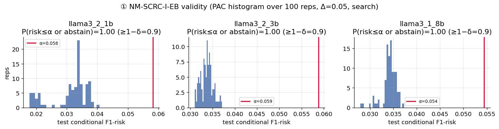
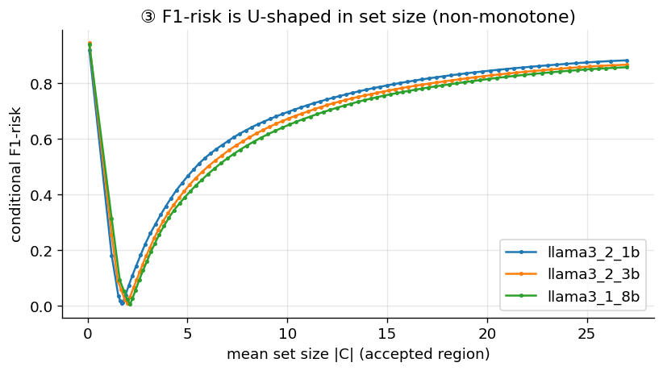
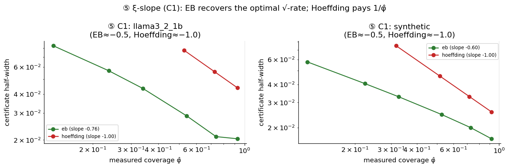
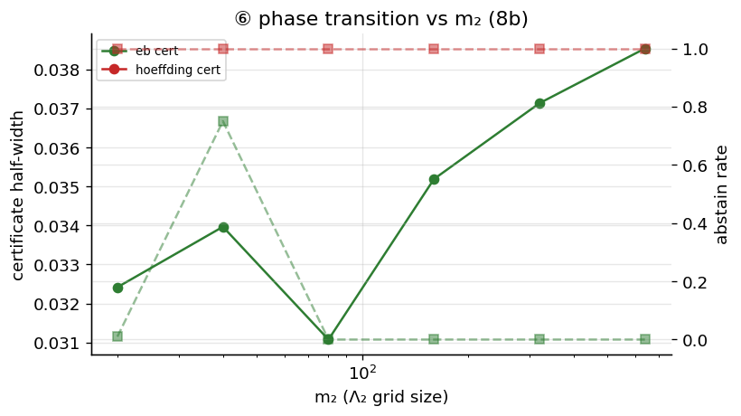
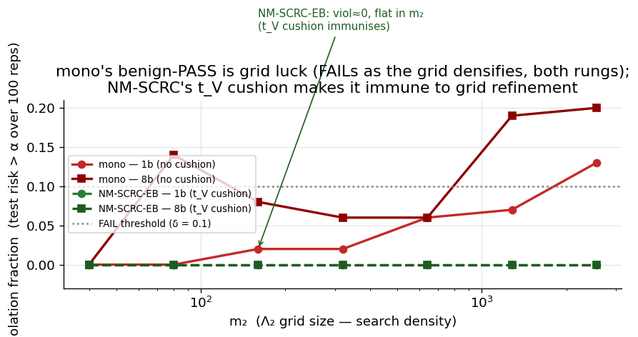
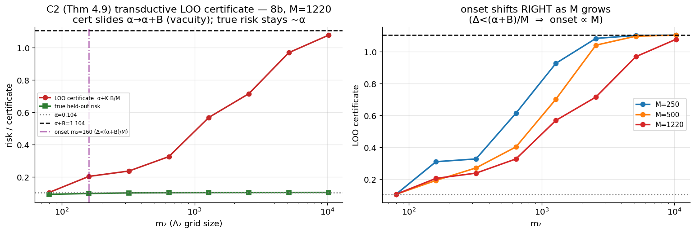

# NM-SCRC — Results report (objective numbers only)

- combined artifact sha256: `bce5e913e56c759227d17c359741b0dbb1f2e0295232e753bcfd5f1e907d0eec`

- models: ['llama3_2_1b', 'llama3_2_3b', 'llama3_1_8b']  ·  split: pool_probe30calibtest70  ·  reps: 100  ·  selector: max_prob  ·  grids: quantile

- use_3b_for_transition: False

- rep-state totals (all judged experiments): {'PASS': 9982, 'ABSTAIN': 3073, 'FAIL': 545}

## Stage 0 — frozen artifacts (probe AUC, oracle ell*, raw-LLM rates, K/M vs M)

| model | probe_val_auc | input_dim | calibtest_n | ell*(xi=0.3) | echo_rate | unparseable | ok_rate | K/M@M20 | K/M@M40 | K/M@M80 |
| --- | --- | --- | --- | --- | --- | --- | --- | --- | --- | --- |
| llama3_2_1b | 0.9984 | 2048 | 8137 | 0.0082 | 0.0108 | 0.2239 | 0.7479 | 0.0 | 0.0 | 0.0 |
| llama3_2_3b | 0.9994 | 3072 | 8137 | 0.0088 | 0.1158 | 0.5559 | 0.2462 | 0.95 | 0.975 | 0.0 |
| llama3_1_8b | 0.9996 | 4096 | 8137 | 0.0044 | 0.0 | 0.0012 | 0.988 | 0.0 | 0.0 | 0.0 |

## (1) Validity + PAC histogram — per rung x variant x Delta

| rung | method | Delta | alpha | n_reps | abstain_rate | frac_risk_le_alpha | frac_safe | mean_risk | p05_risk | p95_risk | mean_cov | mean_set | mean_cert | verdict |
| --- | --- | --- | --- | --- | --- | --- | --- | --- | --- | --- | --- | --- | --- | --- |
| llama3_1_8b | nmscrc_i_eb | 0.02 | 0.0244 | 100 | 0.0 | 1.0 | 1.0 | 0.0104 | 0.0082 | 0.0132 | 0.953 | 1.762 | 0.0133 | PASS |
| llama3_1_8b | nmscrc_i_eb | 0.05 | 0.0544 | 100 | 0.0 | 1.0 | 1.0 | 0.0342 | 0.0308 | 0.036 | 0.849 | 1.63 | 0.0186 | PASS |
| llama3_1_8b | nmscrc_i_eb | 0.1 | 0.1044 | 100 | 0.0 | 1.0 | 1.0 | 0.071 | 0.0594 | 0.0754 | 0.687 | 1.527 | 0.0298 | PASS |
| llama3_1_8b | nmscrc_i_hoeffding | 0.02 | 0.0244 | 100 | 1.0 |  | 1.0 |  |  |  |  |  |  | ABSTAIN |
| llama3_1_8b | nmscrc_i_hoeffding | 0.05 | 0.0544 | 100 | 0.0 | 1.0 | 1.0 | 0.0125 | 0.0101 | 0.0154 | 0.967 | 1.759 | 0.0411 | PASS |
| llama3_1_8b | nmscrc_i_hoeffding | 0.1 | 0.1044 | 100 | 0.0 | 1.0 | 1.0 | 0.0548 | 0.0527 | 0.0584 | 0.875 | 1.591 | 0.0466 | PASS |
| llama3_2_1b | nmscrc_i_eb | 0.02 | 0.0282 | 100 | 1.0 |  | 1.0 |  |  |  |  |  |  | ABSTAIN |
| llama3_2_1b | nmscrc_i_eb | 0.05 | 0.0582 | 100 | 0.0 | 1.0 | 1.0 | 0.0311 | 0.0188 | 0.0375 | 0.557 | 1.628 | 0.0263 | PASS |
| llama3_2_1b | nmscrc_i_eb | 0.1 | 0.1082 | 100 | 0.0 | 1.0 | 1.0 | 0.0594 | 0.056 | 0.0631 | 0.478 | 1.481 | 0.0379 | PASS |
| llama3_2_1b | nmscrc_i_hoeffding | 0.02 | 0.0282 | 100 | 1.0 |  | 1.0 |  |  |  |  |  |  | ABSTAIN |
| llama3_2_1b | nmscrc_i_hoeffding | 0.05 | 0.0582 | 100 | 1.0 |  | 1.0 |  |  |  |  |  |  | ABSTAIN |
| llama3_2_1b | nmscrc_i_hoeffding | 0.1 | 0.1082 | 100 | 0.0 | 1.0 | 1.0 | 0.044 | 0.0397 | 0.0515 | 0.654 | 1.593 | 0.0624 | PASS |
| llama3_2_3b | nmscrc_i_eb | 0.02 | 0.0288 | 100 | 0.0 | 1.0 | 1.0 | 0.0135 | 0.0107 | 0.017 | 0.857 | 1.769 | 0.0151 | PASS |
| llama3_2_3b | nmscrc_i_eb | 0.05 | 0.0588 | 100 | 0.0 | 1.0 | 1.0 | 0.0337 | 0.0316 | 0.036 | 0.863 | 1.613 | 0.0188 | PASS |
| llama3_2_3b | nmscrc_i_eb | 0.1 | 0.1088 | 100 | 0.0 | 1.0 | 1.0 | 0.0664 | 0.0608 | 0.0839 | 0.704 | 1.493 | 0.0285 | PASS |
| llama3_2_3b | nmscrc_i_hoeffding | 0.02 | 0.0288 | 100 | 1.0 |  | 1.0 |  |  |  |  |  |  | ABSTAIN |
| llama3_2_3b | nmscrc_i_hoeffding | 0.05 | 0.0588 | 100 | 0.7 | 1.0 | 1.0 | 0.0169 | 0.0141 | 0.0194 | 0.896 | 1.768 | 0.0444 | PASS |
| llama3_2_3b | nmscrc_i_hoeffding | 0.1 | 0.1088 | 100 | 0.0 | 1.0 | 1.0 | 0.0583 | 0.0429 | 0.0634 | 0.886 | 1.572 | 0.0461 | PASS |

## (3) F1-risk U-shape (oracle ell*, argmin lambda2)

| rung | xi | coverage | min_cond_risk(ell*) | argmin_lambda2 |
| --- | --- | --- | --- | --- |
| llama3_2_1b | 0.3 | 0.305 | 0.0085 | 0.1748 |
| llama3_2_3b | 0.3 | 0.305 | 0.0092 | 0.6065 |
| llama3_1_8b | 0.3 | 0.305 | 0.0048 | 0.5103 |

## (5) xi-slope (C1) — per (rung, variant, xi)

| rung | method | xi | mean_cov | mean_cert | abstain_rate |
| --- | --- | --- | --- | --- | --- |
| llama3_2_1b | nmscrc_i_eb | 0.1 | 0.131 | 0.08283 | 0.0 |
| llama3_2_1b | nmscrc_i_eb | 0.2 | 0.237 | 0.05679 | 0.0 |
| llama3_2_1b | nmscrc_i_eb | 0.3 | 0.34 | 0.04349 | 0.0 |
| llama3_2_1b | nmscrc_i_eb | 0.5 | 0.542 | 0.02872 | 0.0 |
| llama3_2_1b | nmscrc_i_eb | 0.7 | 0.739 | 0.02104 | 0.0 |
| llama3_2_1b | nmscrc_i_eb | 0.9 | 0.926 | 0.02036 | 0.0 |
| llama3_2_1b | nmscrc_i_hoeffding | 0.1 |  |  | 1.0 |
| llama3_2_1b | nmscrc_i_hoeffding | 0.2 |  |  | 1.0 |
| llama3_2_1b | nmscrc_i_hoeffding | 0.3 |  |  | 1.0 |
| llama3_2_1b | nmscrc_i_hoeffding | 0.5 | 0.527 | 0.07721 | 0.0 |
| llama3_2_1b | nmscrc_i_hoeffding | 0.7 | 0.727 | 0.05599 | 0.0 |
| llama3_2_1b | nmscrc_i_hoeffding | 0.9 | 0.926 | 0.04398 | 0.0 |
| synthetic | nmscrc_i_eb | 0.1 | 0.118 | 0.05766 | 0.0 |
| synthetic | nmscrc_i_eb | 0.2 | 0.224 | 0.04071 | 0.0 |
| synthetic | nmscrc_i_eb | 0.3 | 0.326 | 0.03294 | 0.0 |
| synthetic | nmscrc_i_eb | 0.5 | 0.526 | 0.02475 | 0.0 |
| synthetic | nmscrc_i_eb | 0.7 | 0.727 | 0.02007 | 0.0 |
| synthetic | nmscrc_i_eb | 0.9 | 0.918 | 0.01675 | 0.0 |
| synthetic | nmscrc_i_hoeffding | 0.1 |  |  | 1.0 |
| synthetic | nmscrc_i_hoeffding | 0.2 |  |  | 1.0 |
| synthetic | nmscrc_i_hoeffding | 0.3 | 0.317 | 0.0748 | 0.0 |
| synthetic | nmscrc_i_hoeffding | 0.5 | 0.517 | 0.04586 | 0.0 |
| synthetic | nmscrc_i_hoeffding | 0.7 | 0.717 | 0.03305 | 0.0 |
| synthetic | nmscrc_i_hoeffding | 0.9 | 0.919 | 0.02579 | 0.0 |

## (5) xi-slope — fitted log-log slopes (cert ~ coverage)

| rung | method | slope_loglog(cert~cov) |
| --- | --- | --- |
| llama3_2_1b | nmscrc_i_eb | -0.764 |
| synthetic | nmscrc_i_eb | -0.597 |
| llama3_2_1b | nmscrc_i_hoeffding | -1.0 |
| synthetic | nmscrc_i_hoeffding | -1.0 |

## (6) Phase transition vs m2 (llama3_1_8b)

| rung | method | m2 | abstain_rate | mean_cert | mean_cov |
| --- | --- | --- | --- | --- | --- |
| llama3_1_8b | nmscrc_i_eb | 20 | 0.01 | 0.0324 | 0.341 |
| llama3_1_8b | nmscrc_i_eb | 40 | 0.75 | 0.034 | 0.347 |
| llama3_1_8b | nmscrc_i_eb | 80 | 0.0 | 0.0311 | 0.34 |
| llama3_1_8b | nmscrc_i_eb | 160 | 0.0 | 0.0352 | 0.34 |
| llama3_1_8b | nmscrc_i_eb | 320 | 0.0 | 0.0371 | 0.34 |
| llama3_1_8b | nmscrc_i_eb | 640 | 0.0 | 0.0385 | 0.34 |
| llama3_1_8b | nmscrc_i_hoeffding | 20 | 1.0 |  |  |
| llama3_1_8b | nmscrc_i_hoeffding | 40 | 1.0 |  |  |
| llama3_1_8b | nmscrc_i_hoeffding | 80 | 1.0 |  |  |
| llama3_1_8b | nmscrc_i_hoeffding | 160 | 1.0 |  |  |
| llama3_1_8b | nmscrc_i_hoeffding | 320 | 1.0 |  |  |
| llama3_1_8b | nmscrc_i_hoeffding | 640 | 1.0 |  |  |

## (8) NM-SCRC-I vs NM-SCRC-T

| rung | method | alpha | abstain_rate | mean_risk | mean_cov | mean_set | mean_K_over_M |
| --- | --- | --- | --- | --- | --- | --- | --- |
| llama3_1_8b | nmscrc_i_eb | 0.1044 | 0.0 | 0.0513 | 0.34 | 1.816 |  |
| llama3_1_8b | nmscrc_t | 0.1044 | 0.0 | 0.0448 | 0.302 | 1.876 | 0.0 |
| llama3_2_1b | nmscrc_i_eb | 0.1082 | 0.0 | 0.0367 | 0.339 | 1.541 |  |
| llama3_2_1b | nmscrc_t | 0.1082 | 0.0 | 0.0342 | 0.298 | 1.542 | 0.0 |

## Head-to-head (6 judged + raw-LLM/RAND floors; CRC-NM-marginal = MARGINAL caliber)

| rung | method | n_reps | alpha | abstain | mean_risk | mean_cov | mean_set | verdict | ctrl_frac | K_over_M | echo_rate | recall_risk | true_f1_risk |
| --- | --- | --- | --- | --- | --- | --- | --- | --- | --- | --- | --- | --- | --- |
| llama3_1_8b | nmscrc_i_eb | 100 | 0.0544 | 0.0 | 0.0342 | 0.849 | 1.63 | PASS | 1.0 |  |  |  |  |
| llama3_1_8b | nmscrc_i_hoeff | 100 | 0.0544 | 0.0 | 0.0125 | 0.967 | 1.759 | PASS | 1.0 |  |  |  |  |
| llama3_1_8b | nmscrc_t | 100 | 0.0544 | 0.99 | 0.0067 | 0.285 | 2.125 | PASS | 0.007 | 0.097 |  |  |  |
| llama3_1_8b | mono | 100 | 0.0544 | 0.0 | 0.0273 | 0.328 | 1.955 | FAIL | 0.86 |  |  |  |  |
| llama3_1_8b | naive | 100 | 0.0544 | 0.0 | 0.0494 | 0.859 | 1.601 | FAIL | 0.45 |  |  |  |  |
| llama3_1_8b | crcnm_marginal | 100 | 0.0544 | 0.0 | 0.4374 | 1.0 | 13.861 | FAIL | 0.52 |  |  |  |  |
| llama3_1_8b | xu_proxy | 100 | 0.0544 | 0.0 | 0.0227 | 0.328 | 1.981 | PASS | 1.0 |  |  | 0.0355 | 0.0227 |
| llama3_1_8b | raw_llm | 100 | 0.0544 | 0.0 | 0.4904 | 1.0 | 6.109 | floor |  |  | 0.0 |  |  |
| llama3_1_8b | rand | 100 | 0.0544 | 0.98 | 0.0309 | 0.465 | 1.723 | floor |  |  |  |  |  |
| llama3_2_1b | nmscrc_i_eb | 100 | 0.0582 | 0.0 | 0.0311 | 0.557 | 1.628 | PASS | 1.0 |  |  |  |  |
| llama3_2_1b | nmscrc_i_hoeff | 100 | 0.0582 | 1.0 |  |  |  | ABSTAIN |  |  |  |  |  |
| llama3_2_1b | nmscrc_t | 100 | 0.0582 | 0.93 | 0.0105 | 0.297 | 1.712 | PASS | 0.01 | 0.0 |  |  |  |
| llama3_2_1b | mono | 100 | 0.0582 | 0.0 | 0.0362 | 0.325 | 1.545 | PASS | 1.0 |  |  |  |  |
| llama3_2_1b | naive | 100 | 0.0582 | 0.0 | 0.0563 | 0.468 | 1.489 | FAIL | 0.69 |  |  |  |  |
| llama3_2_1b | crcnm_marginal | 100 | 0.0582 | 0.0 | 0.881 | 1.0 | 27.0 | FAIL | 0.0 |  |  |  |  |
| llama3_2_1b | xu_proxy | 100 | 0.0582 | 0.0 | 0.0211 | 0.325 | 1.634 | PASS | 1.0 |  |  | 0.0324 | 0.0211 |
| llama3_2_1b | raw_llm | 100 | 0.0582 | 0.0 | 0.9207 | 1.0 | 10.755 | floor |  |  | 0.010814796608086518 |  |  |
| llama3_2_1b | rand | 100 | 0.0582 | 1.0 |  |  |  | floor |  |  |  |  |  |
| llama3_2_3b | nmscrc_i_eb | 100 | 0.0588 | 0.0 | 0.0337 | 0.863 | 1.613 | PASS | 1.0 |  |  |  |  |
| llama3_2_3b | nmscrc_i_hoeff | 100 | 0.0588 | 0.7 | 0.0169 | 0.896 | 1.768 | PASS | 1.0 |  |  |  |  |
| llama3_2_3b | nmscrc_t | 100 | 0.0588 | 0.89 | 0.0113 | 0.301 | 2.012 | PASS | 0.011 | 0.152 |  |  |  |
| llama3_2_3b | mono | 100 | 0.0588 | 0.0 | 0.0221 | 0.326 | 1.853 | PASS | 0.96 |  |  |  |  |
| llama3_2_3b | naive | 100 | 0.0588 | 0.0 | 0.058 | 0.69 | 1.518 | FAIL | 0.51 |  |  |  |  |
| llama3_2_3b | crcnm_marginal | 100 | 0.0588 | 0.0 | 0.881 | 1.0 | 27.0 | FAIL | 0.0 |  |  |  |  |
| llama3_2_3b | xu_proxy | 100 | 0.0588 | 0.0 | 0.0204 | 0.326 | 1.861 | PASS | 1.0 |  |  | 0.0321 | 0.0204 |
| llama3_2_3b | raw_llm | 100 | 0.0588 | 0.0 | 0.8905 | 1.0 | 0.802 | floor |  |  | 0.11576748187292614 |  |  |
| llama3_2_3b | rand | 100 | 0.0588 | 1.0 |  |  |  | floor |  |  |  |  |  |
| synthetic_f1 | nmscrc_i_eb | 100 | 0.3624 | 0.0 | 0.351 | 0.993 | 4.867 | PASS | 1.0 |  |  |  |  |
| synthetic_f1 | nmscrc_i_hoeff | 100 | 0.3624 | 0.0 | 0.3334 | 0.957 | 5.778 | PASS | 1.0 |  |  |  |  |
| synthetic_f1 | nmscrc_t | 100 | 0.3624 | 0.0 | 0.332 | 0.299 | 5.735 | PASS | 0.332 | 0.088 |  |  |  |
| synthetic_f1 | mono | 100 | 0.3624 | 0.0 | 0.3476 | 0.328 | 4.887 | PASS | 1.0 |  |  |  |  |
| synthetic_f1 | naive | 100 | 0.3624 | 0.0 | 0.3624 | 0.666 | 4.33 | FAIL | 0.59 |  |  |  |  |
| synthetic_f1 | crcnm_marginal | 100 | 0.3624 | 0.0 | 0.3445 | 1.0 | 5.197 | PASS | 1.0 |  |  |  |  |
| synthetic_f1 | xu_proxy | 100 | 0.3624 | 0.0 | 0.3443 | 0.328 | 5.035 | PASS | 1.0 |  |  | 0.3384 | 0.3443 |
| synthetic_f1 | rand | 100 | 0.3624 | 0.48 | 0.3139 | 0.326 | 7.666 | floor |  |  |  |  |  |

## (9) Feasibility floor + union-tax

| method | n_calib | abstain_rate | mean_cert |
| --- | --- | --- | --- |
| nmscrc_i_eb | 1000 | 1.0 |  |
| nmscrc_i_eb | 2000 | 0.76 | 0.0793 |
| nmscrc_i_eb | 4000 | 0.0 | 0.0576 |
| nmscrc_i_eb | 8000 | 0.0 | 0.0407 |
| nmscrc_i_eb | 16000 | 0.0 | 0.0284 |
| nmscrc_i_hoeffding | 1000 | 1.0 |  |
| nmscrc_i_hoeffding | 2000 | 1.0 |  |
| nmscrc_i_hoeffding | 4000 | 1.0 |  |
| nmscrc_i_hoeffding | 8000 | 1.0 |  |
| nmscrc_i_hoeffding | 16000 | 0.0 | 0.0649 |

| method | m1*m2 | mean_cert | abstain_rate |
| --- | --- | --- | --- |
| nmscrc_i_eb | 400 |  | 1.0 |
| nmscrc_i_eb | 1600 | 0.0304 | 0.0 |
| nmscrc_i_eb | 6400 | 0.0329 | 0.0 |
| nmscrc_i_eb | 25600 | 0.035 | 0.0 |
| nmscrc_i_eb | 102400 | 0.0369 | 0.0 |
| nmscrc_i_eb | 409600 | 0.0387 | 0.0 |
| nmscrc_i_hoeffding | 400 |  | 1.0 |
| nmscrc_i_hoeffding | 1600 |  | 1.0 |
| nmscrc_i_hoeffding | 6400 | 0.0747 | 0.0 |
| nmscrc_i_hoeffding | 25600 | 0.0791 | 0.0 |
| nmscrc_i_hoeffding | 102400 | 0.0834 | 0.0 |
| nmscrc_i_hoeffding | 409600 | 0.0872 | 0.0 |

## (6.3) mono grid-refinement — violation fraction vs m2

| rung | method | 40 | 80 | 160 | 320 | 640 | 1280 | 2560 |
| --- | --- | --- | --- | --- | --- | --- | --- | --- |
| llama3_1_8b | mono | 0.0 | 0.14 | 0.08 | 0.06 | 0.06 | 0.19 | 0.2 |
| llama3_1_8b | nmscrc_i_eb | 0.0 | 0.0 | 0.0 | 0.0 | 0.0 | 0.0 | 0.0 |
| llama3_2_1b | mono | 0.0 | 0.0 | 0.02 | 0.02 | 0.06 | 0.07 | 0.13 |
| llama3_2_1b | nmscrc_i_eb | 0.0 | 0.0 | 0.0 | 0.0 | 0.0 | 0.0 | 0.0 |

## (6.7) C2 transductive LOO certificate (Thm 4.9) — cert slides α->α+B, true risk ~α

| M | m2 | n_reps | infeasible_rate | mean_Delta | mean_cert | mean_true_held | K_direct_eq_K_closed |
| --- | --- | --- | --- | --- | --- | --- | --- |
| 250 | 80 | 100 | 0.0 | 0.02589 | 0.1044 | 0.0529 | 1.0 |
| 250 | 160 | 100 | 0.0 | 0.01463 | 0.3092 | 0.0639 | 1.0 |
| 250 | 320 | 100 | 0.0 | 0.00886 | 0.3266 | 0.0701 | 1.0 |
| 250 | 640 | 100 | 0.0 | 0.00436 | 0.6139 | 0.0732 | 1.0 |
| 250 | 1280 | 100 | 0.0 | 0.00229 | 0.9271 | 0.0747 | 1.0 |
| 250 | 2560 | 100 | 0.0 | 0.00128 | 1.0836 | 0.0755 | 1.0 |
| 250 | 5120 | 100 | 0.0 | 0.00075 | 1.1019 | 0.0758 | 1.0 |
| 250 | 10240 | 100 | 0.0 | 0.00061 | 1.1044 | 0.076 | 1.0 |
| 500 | 80 | 100 | 0.0 | 0.03554 | 0.1044 | 0.0529 | 1.0 |
| 500 | 160 | 100 | 0.0 | 0.00917 | 0.1917 | 0.0755 | 1.0 |
| 500 | 320 | 100 | 0.0 | 0.00599 | 0.2701 | 0.0781 | 1.0 |
| 500 | 640 | 100 | 0.0 | 0.00312 | 0.4021 | 0.08 | 1.0 |
| 500 | 1280 | 100 | 0.0 | 0.00178 | 0.7021 | 0.081 | 1.0 |
| 500 | 2560 | 100 | 0.0 | 0.00088 | 1.041 | 0.0816 | 1.0 |
| 500 | 5120 | 100 | 0.0 | 0.00054 | 1.0976 | 0.0819 | 1.0 |
| 500 | 10240 | 100 | 0.0 | 0.00033 | 1.1038 | 0.082 | 1.0 |
| 1220 | 80 | 100 | 0.0 | 0.01196 | 0.1044 | 0.0936 | 1.0 |
| 1220 | 160 | 100 | 0.0 | 0.0073 | 0.2044 | 0.0986 | 1.0 |
| 1220 | 320 | 100 | 0.0 | 0.00334 | 0.2374 | 0.1022 | 1.0 |
| 1220 | 640 | 100 | 0.0 | 0.00214 | 0.3266 | 0.1034 | 1.0 |
| 1220 | 1280 | 100 | 0.0 | 0.00114 | 0.5687 | 0.1045 | 1.0 |
| 1220 | 2560 | 100 | 0.0 | 0.00078 | 0.7153 | 0.1048 | 1.0 |
| 1220 | 5120 | 100 | 0.0 | 0.00043 | 0.9689 | 0.1052 | 1.0 |
| 1220 | 10240 | 100 | 0.0 | 0.00026 | 1.0776 | 0.1054 | 1.0 |
