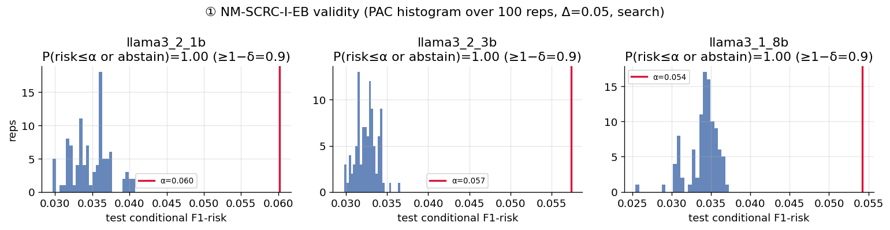
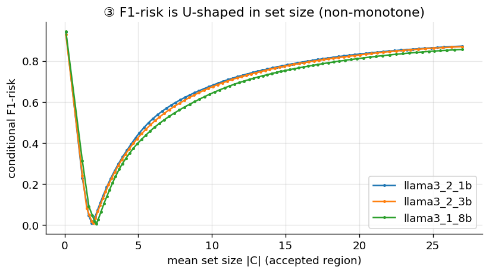
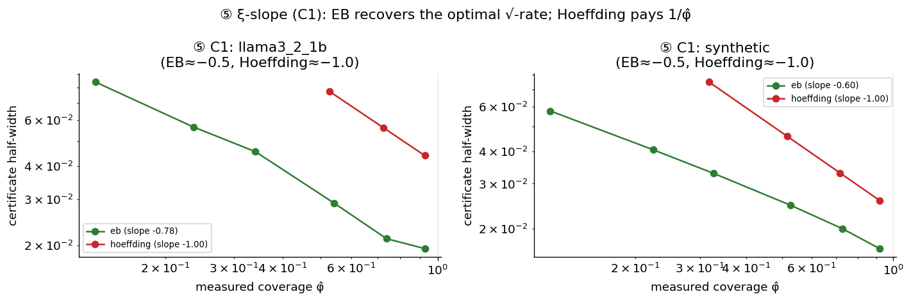
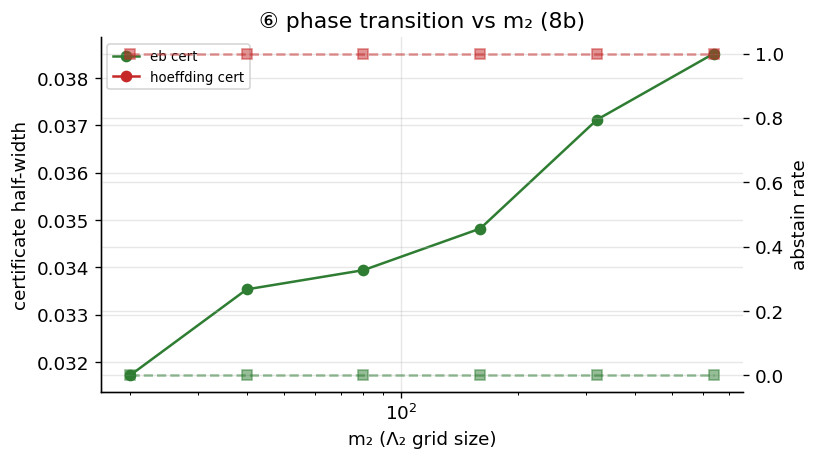
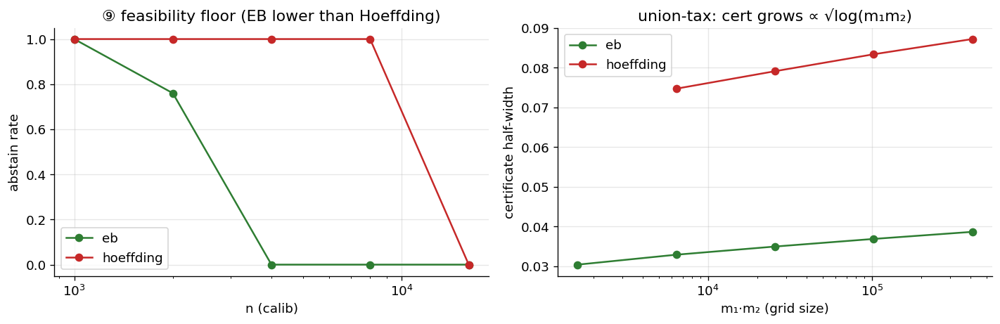
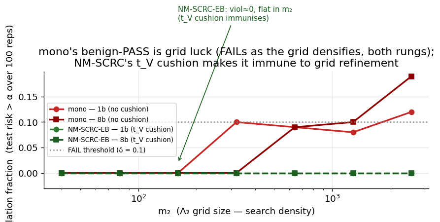
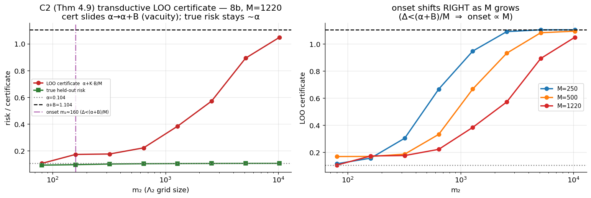

# NM-SCRC — Results report (objective numbers only)

- combined artifact sha256: `a44353eb87b982b85e8bde8430631f3c2358bb3ce70cf17996281ab67f99e0c0`

- models: ['llama3_2_1b', 'llama3_2_3b', 'llama3_1_8b']  ·  split: pool_probe30calibtest70  ·  reps: 100  ·  selector: max_prob  ·  grids: quantile

- use_3b_for_transition: False

- rep-state totals (all judged experiments): {'PASS': 10145, 'ABSTAIN': 2932, 'FAIL': 523}

## Stage 0 — frozen artifacts (probe AUC, oracle ell*, raw-LLM rates, K/M vs M)

| model | probe_val_auc | input_dim | calibtest_n | ell*(xi=0.3) | echo_rate | unparseable | ok_rate | K/M@M20 | K/M@M40 | K/M@M80 |
| --- | --- | --- | --- | --- | --- | --- | --- | --- | --- | --- |
| llama3_2_1b | 0.9986 | 2048 | 8137 | 0.0102 | 0.027 | 0.0928 | 0.853 | 0.0 | 0.975 | 0.0 |
| llama3_2_3b | 0.9995 | 3072 | 8137 | 0.0074 | 0.2661 | 0.0086 | 0.7044 | 0.95 | 0.8 | 0.0 |
| llama3_1_8b | 0.9996 | 4096 | 8137 | 0.0043 | 0.0 | 0.0016 | 0.9883 | 0.0 | 0.0 | 0.9875 |

## (1) Validity + PAC histogram — per rung x variant x Delta

| rung | method | Delta | alpha | n_reps | abstain_rate | frac_risk_le_alpha | frac_safe | mean_risk | p05_risk | p95_risk | mean_cov | mean_set | mean_cert | verdict |
| --- | --- | --- | --- | --- | --- | --- | --- | --- | --- | --- | --- | --- | --- | --- |
| llama3_1_8b | nmscrc_i_eb | 0.02 | 0.0243 | 100 | 0.0 | 1.0 | 1.0 | 0.0102 | 0.0077 | 0.0119 | 0.956 | 1.77 | 0.0133 | PASS |
| llama3_1_8b | nmscrc_i_eb | 0.05 | 0.0543 | 100 | 0.0 | 1.0 | 1.0 | 0.034 | 0.0306 | 0.0364 | 0.833 | 1.656 | 0.0191 | PASS |
| llama3_1_8b | nmscrc_i_eb | 0.1 | 0.1043 | 100 | 0.0 | 1.0 | 1.0 | 0.0655 | 0.0621 | 0.0684 | 0.7 | 1.585 | 0.0297 | PASS |
| llama3_1_8b | nmscrc_i_hoeffding | 0.02 | 0.0243 | 100 | 1.0 |  | 1.0 |  |  |  |  |  |  | ABSTAIN |
| llama3_1_8b | nmscrc_i_hoeffding | 0.05 | 0.0543 | 100 | 0.0 | 1.0 | 1.0 | 0.0125 | 0.0092 | 0.0152 | 0.97 | 1.766 | 0.041 | PASS |
| llama3_1_8b | nmscrc_i_hoeffding | 0.1 | 0.1043 | 100 | 0.0 | 1.0 | 1.0 | 0.0536 | 0.0395 | 0.0576 | 0.862 | 1.615 | 0.0473 | PASS |
| llama3_2_1b | nmscrc_i_eb | 0.02 | 0.0302 | 100 | 0.93 | 1.0 | 1.0 | 0.016 | 0.0149 | 0.0175 | 0.644 | 1.794 | 0.0182 | PASS |
| llama3_2_1b | nmscrc_i_eb | 0.05 | 0.0602 | 100 | 0.0 | 1.0 | 1.0 | 0.0348 | 0.0306 | 0.0397 | 0.615 | 1.666 | 0.0249 | PASS |
| llama3_2_1b | nmscrc_i_eb | 0.1 | 0.1102 | 100 | 0.0 | 1.0 | 1.0 | 0.0666 | 0.0593 | 0.0714 | 0.464 | 1.523 | 0.04 | PASS |
| llama3_2_1b | nmscrc_i_hoeffding | 0.02 | 0.0302 | 100 | 1.0 |  | 1.0 |  |  |  |  |  |  | ABSTAIN |
| llama3_2_1b | nmscrc_i_hoeffding | 0.05 | 0.0602 | 100 | 1.0 |  | 1.0 |  |  |  |  |  |  | ABSTAIN |
| llama3_2_1b | nmscrc_i_hoeffding | 0.1 | 0.1102 | 100 | 0.0 | 1.0 | 1.0 | 0.0424 | 0.0393 | 0.0451 | 0.644 | 1.632 | 0.0635 | PASS |
| llama3_2_3b | nmscrc_i_eb | 0.02 | 0.0274 | 100 | 0.0 | 1.0 | 1.0 | 0.0125 | 0.0092 | 0.0157 | 0.868 | 1.776 | 0.0145 | PASS |
| llama3_2_3b | nmscrc_i_eb | 0.05 | 0.0574 | 100 | 0.0 | 1.0 | 1.0 | 0.0325 | 0.0305 | 0.0343 | 0.851 | 1.637 | 0.0192 | PASS |
| llama3_2_3b | nmscrc_i_eb | 0.1 | 0.1074 | 100 | 0.0 | 1.0 | 1.0 | 0.0647 | 0.0612 | 0.0672 | 0.69 | 1.525 | 0.0296 | PASS |
| llama3_2_3b | nmscrc_i_hoeffding | 0.02 | 0.0274 | 100 | 1.0 |  | 1.0 |  |  |  |  |  |  | ABSTAIN |
| llama3_2_3b | nmscrc_i_hoeffding | 0.05 | 0.0574 | 100 | 0.48 | 1.0 | 1.0 | 0.0126 | 0.0102 | 0.0175 | 0.859 | 1.779 | 0.0463 | PASS |
| llama3_2_3b | nmscrc_i_hoeffding | 0.1 | 0.1074 | 100 | 0.0 | 1.0 | 1.0 | 0.056 | 0.0429 | 0.0639 | 0.872 | 1.597 | 0.0469 | PASS |

## (3) F1-risk U-shape (oracle ell*, argmin lambda2)

| rung | xi | coverage | min_cond_risk(ell*) | argmin_lambda2 |
| --- | --- | --- | --- | --- |
| llama3_2_1b | 0.3 | 0.305 | 0.0102 | 0.1678 |
| llama3_2_3b | 0.3 | 0.305 | 0.0081 | 0.5867 |
| llama3_1_8b | 0.3 | 0.305 | 0.005 | 0.5135 |

## (5) xi-slope (C1) — per (rung, variant, xi)

| rung | method | xi | mean_cov | mean_cert | abstain_rate |
| --- | --- | --- | --- | --- | --- |
| llama3_2_1b | nmscrc_i_eb | 0.1 | 0.132 | 0.08393 | 0.0 |
| llama3_2_1b | nmscrc_i_eb | 0.2 | 0.236 | 0.05647 | 0.0 |
| llama3_2_1b | nmscrc_i_eb | 0.3 | 0.34 | 0.04551 | 0.0 |
| llama3_2_1b | nmscrc_i_eb | 0.5 | 0.541 | 0.02899 | 0.0 |
| llama3_2_1b | nmscrc_i_eb | 0.7 | 0.739 | 0.0212 | 0.0 |
| llama3_2_1b | nmscrc_i_eb | 0.9 | 0.926 | 0.01943 | 0.0 |
| llama3_2_1b | nmscrc_i_hoeffding | 0.1 |  |  | 1.0 |
| llama3_2_1b | nmscrc_i_hoeffding | 0.2 |  |  | 1.0 |
| llama3_2_1b | nmscrc_i_hoeffding | 0.3 |  |  | 1.0 |
| llama3_2_1b | nmscrc_i_hoeffding | 0.5 | 0.527 | 0.07731 | 0.0 |
| llama3_2_1b | nmscrc_i_hoeffding | 0.7 | 0.726 | 0.05606 | 0.0 |
| llama3_2_1b | nmscrc_i_hoeffding | 0.9 | 0.926 | 0.04397 | 0.0 |
| synthetic | nmscrc_i_eb | 0.1 | 0.118 | 0.05766 | 0.0 |
| synthetic | nmscrc_i_eb | 0.2 | 0.224 | 0.04071 | 0.0 |
| synthetic | nmscrc_i_eb | 0.3 | 0.326 | 0.03294 | 0.0 |
| synthetic | nmscrc_i_eb | 0.5 | 0.526 | 0.02475 | 0.0 |
| synthetic | nmscrc_i_eb | 0.7 | 0.727 | 0.02007 | 0.0 |
| synthetic | nmscrc_i_eb | 0.9 | 0.918 | 0.01675 | 0.0 |
| synthetic | nmscrc_i_hoeffding | 0.1 |  |  | 1.0 |
| synthetic | nmscrc_i_hoeffding | 0.2 |  |  | 1.0 |
| synthetic | nmscrc_i_hoeffding | 0.3 | 0.317 | 0.0748 | 0.0 |
| synthetic | nmscrc_i_hoeffding | 0.5 | 0.517 | 0.04586 | 0.0 |
| synthetic | nmscrc_i_hoeffding | 0.7 | 0.717 | 0.03305 | 0.0 |
| synthetic | nmscrc_i_hoeffding | 0.9 | 0.919 | 0.02579 | 0.0 |

## (5) xi-slope — fitted log-log slopes (cert ~ coverage)

| rung | method | slope_loglog(cert~cov) |
| --- | --- | --- |
| llama3_2_1b | nmscrc_i_eb | -0.784 |
| synthetic | nmscrc_i_eb | -0.597 |
| llama3_2_1b | nmscrc_i_hoeffding | -1.0 |
| synthetic | nmscrc_i_hoeffding | -1.0 |

## (6) Phase transition vs m2 (llama3_1_8b)

| rung | method | m2 | abstain_rate | mean_cert | mean_cov |
| --- | --- | --- | --- | --- | --- |
| llama3_1_8b | nmscrc_i_eb | 20 | 0.0 | 0.0317 | 0.341 |
| llama3_1_8b | nmscrc_i_eb | 40 | 0.0 | 0.0335 | 0.341 |
| llama3_1_8b | nmscrc_i_eb | 80 | 0.0 | 0.0339 | 0.341 |
| llama3_1_8b | nmscrc_i_eb | 160 | 0.0 | 0.0348 | 0.341 |
| llama3_1_8b | nmscrc_i_eb | 320 | 0.0 | 0.0371 | 0.341 |
| llama3_1_8b | nmscrc_i_eb | 640 | 0.0 | 0.0385 | 0.341 |
| llama3_1_8b | nmscrc_i_hoeffding | 20 | 1.0 |  |  |
| llama3_1_8b | nmscrc_i_hoeffding | 40 | 1.0 |  |  |
| llama3_1_8b | nmscrc_i_hoeffding | 80 | 1.0 |  |  |
| llama3_1_8b | nmscrc_i_hoeffding | 160 | 1.0 |  |  |
| llama3_1_8b | nmscrc_i_hoeffding | 320 | 1.0 |  |  |
| llama3_1_8b | nmscrc_i_hoeffding | 640 | 1.0 |  |  |

## (8) NM-SCRC-I vs NM-SCRC-T

| rung | method | alpha | abstain_rate | mean_risk | mean_cov | mean_set | mean_K_over_M |
| --- | --- | --- | --- | --- | --- | --- | --- |
| llama3_1_8b | nmscrc_i_eb | 0.1043 | 0.0 | 0.0472 | 0.341 | 1.846 |  |
| llama3_1_8b | nmscrc_t | 0.1043 | 0.0 | 0.046 | 0.301 | 1.895 | 0.0 |
| llama3_2_1b | nmscrc_i_eb | 0.1102 | 0.0 | 0.0485 | 0.339 | 1.611 |  |
| llama3_2_1b | nmscrc_t | 0.1102 | 0.0 | 0.0469 | 0.299 | 1.637 | 0.0 |

## Head-to-head (6 judged + raw-LLM/RAND floors; CRC-NM-marginal = MARGINAL caliber)

| rung | method | n_reps | alpha | abstain | mean_risk | mean_cov | mean_set | verdict | ctrl_frac | K_over_M | echo_rate | recall_risk | true_f1_risk |
| --- | --- | --- | --- | --- | --- | --- | --- | --- | --- | --- | --- | --- | --- |
| llama3_1_8b | nmscrc_i_eb | 100 | 0.0543 | 0.0 | 0.034 | 0.833 | 1.656 | PASS | 1.0 |  |  |  |  |
| llama3_1_8b | nmscrc_i_hoeff | 100 | 0.0543 | 0.0 | 0.0125 | 0.97 | 1.766 | PASS | 1.0 |  |  |  |  |
| llama3_1_8b | nmscrc_t | 100 | 0.0543 | 1.0 |  |  |  | ABSTAIN |  | 0.0 |  |  |  |
| llama3_1_8b | mono | 100 | 0.0543 | 0.0 | 0.0466 | 0.328 | 1.862 | PASS | 1.0 |  |  |  |  |
| llama3_1_8b | naive | 100 | 0.0543 | 0.0 | 0.0526 | 0.779 | 1.62 | FAIL | 0.28 |  |  |  |  |
| llama3_1_8b | crcnm_marginal | 100 | 0.0543 | 0.0 | 0.745 | 1.0 | 22.957 | FAIL | 0.16 |  |  |  |  |
| llama3_1_8b | xu_proxy | 100 | 0.0543 | 0.0 | 0.0182 | 0.328 | 2.015 | PASS | 1.0 |  |  | 0.0286 | 0.0182 |
| llama3_1_8b | raw_llm | 100 | 0.0543 | 0.0 | 0.5357 | 1.0 | 7.842 | floor |  |  | 0.0 |  |  |
| llama3_1_8b | rand | 100 | 0.0543 | 1.0 |  |  |  | floor |  |  |  |  |  |
| llama3_2_1b | nmscrc_i_eb | 100 | 0.0602 | 0.0 | 0.0348 | 0.615 | 1.666 | PASS | 1.0 |  |  |  |  |
| llama3_2_1b | nmscrc_i_hoeff | 100 | 0.0602 | 1.0 |  |  |  | ABSTAIN |  |  |  |  |  |
| llama3_2_1b | nmscrc_t | 100 | 0.0602 | 0.73 | 0.0115 | 0.301 | 1.861 | PASS | 0.011 | 0.0 |  |  |  |
| llama3_2_1b | mono | 100 | 0.0602 | 0.0 | 0.0483 | 0.326 | 1.62 | PASS | 1.0 |  |  |  |  |
| llama3_2_1b | naive | 100 | 0.0602 | 0.0 | 0.0596 | 0.437 | 1.551 | FAIL | 0.52 |  |  |  |  |
| llama3_2_1b | crcnm_marginal | 100 | 0.0602 | 0.0 | 0.881 | 1.0 | 27.0 | FAIL | 0.0 |  |  |  |  |
| llama3_2_1b | xu_proxy | 100 | 0.0602 | 0.0 | 0.0219 | 0.326 | 1.769 | PASS | 1.0 |  |  | 0.0337 | 0.0219 |
| llama3_2_1b | raw_llm | 100 | 0.0602 | 0.0 | 0.8927 | 1.0 | 11.813 | floor |  |  | 0.027036991520216297 |  |  |
| llama3_2_1b | rand | 100 | 0.0602 | 1.0 |  |  |  | floor |  |  |  |  |  |
| llama3_2_3b | nmscrc_i_eb | 100 | 0.0574 | 0.0 | 0.0325 | 0.851 | 1.637 | PASS | 1.0 |  |  |  |  |
| llama3_2_3b | nmscrc_i_hoeff | 100 | 0.0574 | 0.48 | 0.0126 | 0.859 | 1.779 | PASS | 1.0 |  |  |  |  |
| llama3_2_3b | nmscrc_t | 100 | 0.0574 | 0.94 | 0.0104 | 0.301 | 1.957 | PASS | 0.01 | 0.0 |  |  |  |
| llama3_2_3b | mono | 100 | 0.0574 | 0.0 | 0.0465 | 0.326 | 1.685 | PASS | 1.0 |  |  |  |  |
| llama3_2_3b | naive | 100 | 0.0574 | 0.0 | 0.0544 | 0.677 | 1.545 | PASS | 0.99 |  |  |  |  |
| llama3_2_3b | crcnm_marginal | 100 | 0.0574 | 0.0 | 0.881 | 1.0 | 27.0 | FAIL | 0.0 |  |  |  |  |
| llama3_2_3b | xu_proxy | 100 | 0.0574 | 0.0 | 0.0185 | 0.326 | 1.831 | PASS | 1.0 |  |  | 0.0289 | 0.0185 |
| llama3_2_3b | raw_llm | 100 | 0.0574 | 0.0 | 0.7171 | 1.0 | 3.913 | floor |  |  | 0.26606857564212855 |  |  |
| llama3_2_3b | rand | 100 | 0.0574 | 1.0 |  |  |  | floor |  |  |  |  |  |
| synthetic_f1 | nmscrc_i_eb | 100 | 0.3624 | 0.0 | 0.351 | 0.993 | 4.867 | PASS | 1.0 |  |  |  |  |
| synthetic_f1 | nmscrc_i_hoeff | 100 | 0.3624 | 0.0 | 0.3334 | 0.957 | 5.778 | PASS | 1.0 |  |  |  |  |
| synthetic_f1 | nmscrc_t | 100 | 0.3624 | 0.0 | 0.332 | 0.299 | 5.735 | PASS | 0.332 | 0.088 |  |  |  |
| synthetic_f1 | mono | 100 | 0.3624 | 0.0 | 0.3476 | 0.328 | 4.887 | PASS | 1.0 |  |  |  |  |
| synthetic_f1 | naive | 100 | 0.3624 | 0.0 | 0.3624 | 0.666 | 4.33 | FAIL | 0.59 |  |  |  |  |
| synthetic_f1 | crcnm_marginal | 100 | 0.3624 | 0.0 | 0.3445 | 1.0 | 5.197 | PASS | 1.0 |  |  |  |  |
| synthetic_f1 | xu_proxy | 100 | 0.3624 | 0.0 | 0.3443 | 0.328 | 5.035 | PASS | 1.0 |  |  | 0.3384 | 0.3443 |
| synthetic_f1 | rand | 100 | 0.3624 | 0.48 | 0.3139 | 0.326 | 7.666 | floor |  |  |  |  |  |

## (9) Feasibility floor + union-tax

| method | n_calib | abstain_rate | mean_cert |
| --- | --- | --- | --- |
| nmscrc_i_eb | 1000 | 1.0 |  |
| nmscrc_i_eb | 2000 | 0.76 | 0.0793 |
| nmscrc_i_eb | 4000 | 0.0 | 0.0576 |
| nmscrc_i_eb | 8000 | 0.0 | 0.0407 |
| nmscrc_i_eb | 16000 | 0.0 | 0.0284 |
| nmscrc_i_hoeffding | 1000 | 1.0 |  |
| nmscrc_i_hoeffding | 2000 | 1.0 |  |
| nmscrc_i_hoeffding | 4000 | 1.0 |  |
| nmscrc_i_hoeffding | 8000 | 1.0 |  |
| nmscrc_i_hoeffding | 16000 | 0.0 | 0.0649 |

| method | m1*m2 | mean_cert | abstain_rate |
| --- | --- | --- | --- |
| nmscrc_i_eb | 400 |  | 1.0 |
| nmscrc_i_eb | 1600 | 0.0304 | 0.0 |
| nmscrc_i_eb | 6400 | 0.0329 | 0.0 |
| nmscrc_i_eb | 25600 | 0.035 | 0.0 |
| nmscrc_i_eb | 102400 | 0.0369 | 0.0 |
| nmscrc_i_eb | 409600 | 0.0387 | 0.0 |
| nmscrc_i_hoeffding | 400 |  | 1.0 |
| nmscrc_i_hoeffding | 1600 |  | 1.0 |
| nmscrc_i_hoeffding | 6400 | 0.0747 | 0.0 |
| nmscrc_i_hoeffding | 25600 | 0.0791 | 0.0 |
| nmscrc_i_hoeffding | 102400 | 0.0834 | 0.0 |
| nmscrc_i_hoeffding | 409600 | 0.0872 | 0.0 |

## (6.3) mono grid-refinement — violation fraction vs m2

| rung | method | 40 | 80 | 160 | 320 | 640 | 1280 | 2560 |
| --- | --- | --- | --- | --- | --- | --- | --- | --- |
| llama3_1_8b | mono | 0.0 | 0.0 | 0.0 | 0.0 | 0.09 | 0.1 | 0.19 |
| llama3_1_8b | nmscrc_i_eb | 0.0 | 0.0 | 0.0 | 0.0 | 0.0 | 0.0 | 0.0 |
| llama3_2_1b | mono | 0.0 | 0.0 | 0.0 | 0.1 | 0.09 | 0.08 | 0.12 |
| llama3_2_1b | nmscrc_i_eb | 0.0 | 0.0 | 0.0 | 0.0 | 0.0 | 0.0 | 0.0 |

## (6.7) C2 transductive LOO certificate (Thm 4.9) — cert slides α->α+B, true risk ~α

| M | m2 | n_reps | infeasible_rate | mean_Delta | mean_cert | mean_true_held | K_direct_eq_K_closed |
| --- | --- | --- | --- | --- | --- | --- | --- |
| 250 | 80 | 100 | 0.0 | 0.03745 | 0.1143 | 0.0469 | 1.0 |
| 250 | 160 | 100 | 0.0 | 0.01311 | 0.1559 | 0.0706 | 1.0 |
| 250 | 320 | 100 | 0.0 | 0.00808 | 0.3033 | 0.075 | 1.0 |
| 250 | 640 | 100 | 0.0 | 0.00403 | 0.666 | 0.0783 | 1.0 |
| 250 | 1280 | 100 | 0.0 | 0.00227 | 0.9468 | 0.0797 | 1.0 |
| 250 | 2560 | 100 | 0.0 | 0.00126 | 1.0907 | 0.0803 | 1.0 |
| 250 | 5120 | 100 | 0.0 | 0.00076 | 1.104 | 0.0808 | 1.0 |
| 250 | 10240 | 100 | 0.0 | 0.00061 | 1.104 | 0.0809 | 1.0 |
| 500 | 80 | 100 | 0.0 | 0.03859 | 0.1677 | 0.0574 | 1.0 |
| 500 | 160 | 100 | 0.0 | 0.01848 | 0.1686 | 0.0754 | 1.0 |
| 500 | 320 | 100 | 0.0 | 0.00763 | 0.1855 | 0.085 | 1.0 |
| 500 | 640 | 100 | 0.0 | 0.00385 | 0.3316 | 0.0875 | 1.0 |
| 500 | 1280 | 100 | 0.0 | 0.00186 | 0.6664 | 0.0889 | 1.0 |
| 500 | 2560 | 100 | 0.0 | 0.00109 | 0.9311 | 0.0893 | 1.0 |
| 500 | 5120 | 100 | 0.0 | 0.00064 | 1.0824 | 0.0896 | 1.0 |
| 500 | 10240 | 100 | 0.0 | 0.00036 | 1.094 | 0.0897 | 1.0 |
| 1220 | 80 | 100 | 0.0 | 0.01323 | 0.1043 | 0.0917 | 1.0 |
| 1220 | 160 | 100 | 0.0 | 0.01014 | 0.1719 | 0.095 | 1.0 |
| 1220 | 320 | 100 | 0.0 | 0.00494 | 0.1751 | 0.1 | 1.0 |
| 1220 | 640 | 100 | 0.0 | 0.00287 | 0.221 | 0.1022 | 1.0 |
| 1220 | 1280 | 100 | 0.0 | 0.00161 | 0.383 | 0.1035 | 1.0 |
| 1220 | 2560 | 100 | 0.0 | 0.00099 | 0.5708 | 0.1041 | 1.0 |
| 1220 | 5120 | 100 | 0.0 | 0.0005 | 0.8921 | 0.1046 | 1.0 |
| 1220 | 10240 | 100 | 0.0 | 0.00032 | 1.0484 | 0.1048 | 1.0 |
