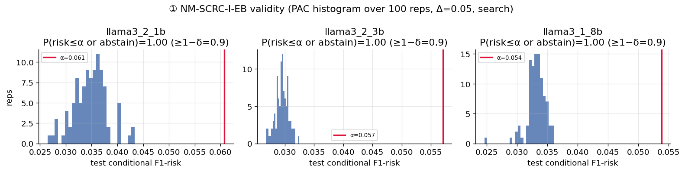
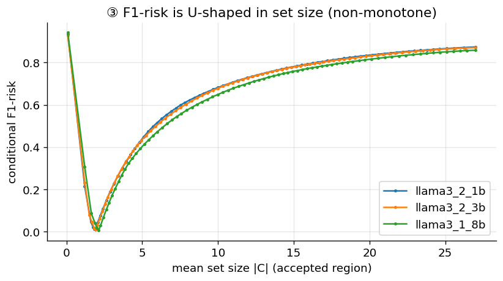
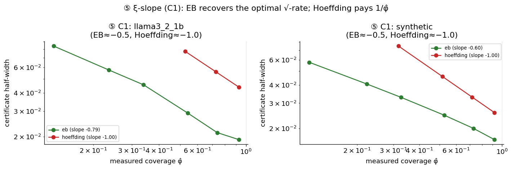
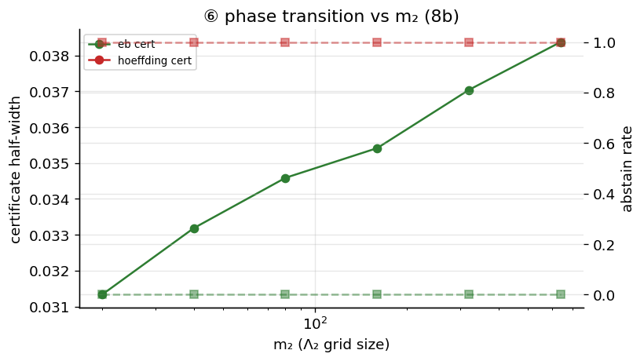
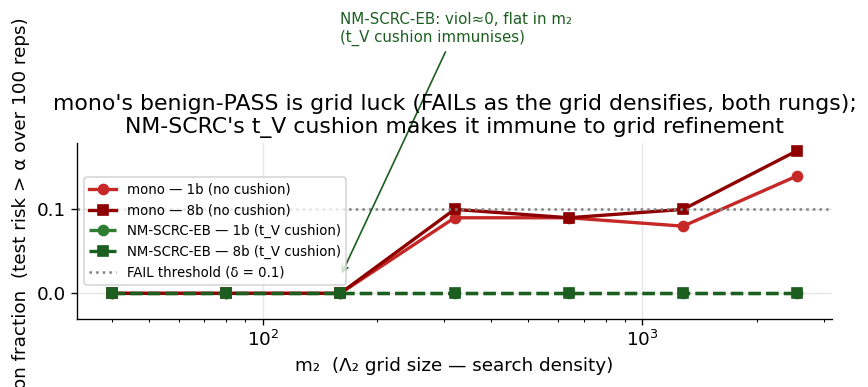
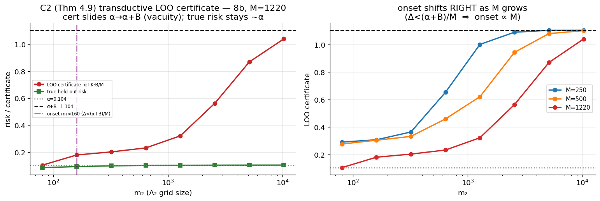

# NM-SCRC — Results report (objective numbers only)

- combined artifact sha256: `9b4b7896fcc09c324ae640665fee5e17e1d068e6a58581d71199d2c123010c4a`

- models: ['llama3_2_1b', 'llama3_2_3b', 'llama3_1_8b']  ·  split: pool_probe30calibtest70  ·  reps: 100  ·  selector: max_prob  ·  grids: quantile

- use_3b_for_transition: False

- rep-state totals (all judged experiments): {'PASS': 10165, 'ABSTAIN': 2869, 'FAIL': 566}

## Stage 0 — frozen artifacts (probe AUC, oracle ell*, raw-LLM rates, K/M vs M)

| model | probe_val_auc | input_dim | calibtest_n | ell*(xi=0.3) | echo_rate | unparseable | ok_rate | K/M@M20 | K/M@M40 | K/M@M80 |
| --- | --- | --- | --- | --- | --- | --- | --- | --- | --- | --- |
| llama3_2_1b | 0.9987 | 2048 | 8137 | 0.0108 | 0.0 | 0.3322 | 0.6627 | 0.0 | 0.0 | 0.0 |
| llama3_2_3b | 0.9994 | 3072 | 8137 | 0.0071 | 0.2183 | 0.0042 | 0.7751 | 0.9 | 0.0 | 0.0 |
| llama3_1_8b | 0.9997 | 4096 | 8137 | 0.0038 | 0.0006 | 0.0007 | 0.9932 | 0.0 | 0.9 | 0.0 |

## (1) Validity + PAC histogram — per rung x variant x Delta

| rung | method | Delta | alpha | n_reps | abstain_rate | frac_risk_le_alpha | frac_safe | mean_risk | p05_risk | p95_risk | mean_cov | mean_set | mean_cert | verdict |
| --- | --- | --- | --- | --- | --- | --- | --- | --- | --- | --- | --- | --- | --- | --- |
| llama3_1_8b | nmscrc_i_eb | 0.02 | 0.0238 | 100 | 0.0 | 1.0 | 1.0 | 0.0098 | 0.0078 | 0.0121 | 0.957 | 1.771 | 0.0133 | PASS |
| llama3_1_8b | nmscrc_i_eb | 0.05 | 0.0538 | 100 | 0.0 | 1.0 | 1.0 | 0.0332 | 0.0305 | 0.0353 | 0.837 | 1.657 | 0.019 | PASS |
| llama3_1_8b | nmscrc_i_eb | 0.1 | 0.1038 | 100 | 0.0 | 1.0 | 1.0 | 0.0671 | 0.0635 | 0.0702 | 0.697 | 1.586 | 0.0303 | PASS |
| llama3_1_8b | nmscrc_i_hoeffding | 0.02 | 0.0238 | 100 | 1.0 |  | 1.0 |  |  |  |  |  |  | ABSTAIN |
| llama3_1_8b | nmscrc_i_hoeffding | 0.05 | 0.0538 | 100 | 0.0 | 1.0 | 1.0 | 0.012 | 0.009 | 0.0148 | 0.969 | 1.768 | 0.041 | PASS |
| llama3_1_8b | nmscrc_i_hoeffding | 0.1 | 0.1038 | 100 | 0.0 | 1.0 | 1.0 | 0.0516 | 0.0401 | 0.0598 | 0.859 | 1.622 | 0.0475 | PASS |
| llama3_2_1b | nmscrc_i_eb | 0.02 | 0.0308 | 100 | 0.9 | 1.0 | 1.0 | 0.0168 | 0.0154 | 0.0188 | 0.7 | 1.837 | 0.0175 | PASS |
| llama3_2_1b | nmscrc_i_eb | 0.05 | 0.0608 | 100 | 0.0 | 1.0 | 1.0 | 0.0347 | 0.0293 | 0.0402 | 0.581 | 1.659 | 0.0257 | PASS |
| llama3_2_1b | nmscrc_i_eb | 0.1 | 0.1108 | 100 | 0.0 | 1.0 | 1.0 | 0.0631 | 0.0594 | 0.067 | 0.466 | 1.512 | 0.0392 | PASS |
| llama3_2_1b | nmscrc_i_hoeffding | 0.02 | 0.0308 | 100 | 1.0 |  | 1.0 |  |  |  |  |  |  | ABSTAIN |
| llama3_2_1b | nmscrc_i_hoeffding | 0.05 | 0.0608 | 100 | 1.0 |  | 1.0 |  |  |  |  |  |  | ABSTAIN |
| llama3_2_1b | nmscrc_i_hoeffding | 0.1 | 0.1108 | 100 | 0.0 | 1.0 | 1.0 | 0.0447 | 0.0398 | 0.0478 | 0.65 | 1.612 | 0.0628 | PASS |
| llama3_2_3b | nmscrc_i_eb | 0.02 | 0.0271 | 100 | 0.0 | 1.0 | 1.0 | 0.0112 | 0.009 | 0.0144 | 0.867 | 1.768 | 0.0142 | PASS |
| llama3_2_3b | nmscrc_i_eb | 0.05 | 0.0571 | 100 | 0.0 | 1.0 | 1.0 | 0.0295 | 0.0277 | 0.0313 | 0.851 | 1.637 | 0.0185 | PASS |
| llama3_2_3b | nmscrc_i_eb | 0.1 | 0.1071 | 100 | 0.0 | 1.0 | 1.0 | 0.0706 | 0.0547 | 0.0768 | 0.7 | 1.502 | 0.0309 | PASS |
| llama3_2_3b | nmscrc_i_hoeffding | 0.02 | 0.0271 | 100 | 1.0 |  | 1.0 |  |  |  |  |  |  | ABSTAIN |
| llama3_2_3b | nmscrc_i_hoeffding | 0.05 | 0.0571 | 100 | 0.19 | 1.0 | 1.0 | 0.0119 | 0.0097 | 0.0155 | 0.874 | 1.768 | 0.0456 | PASS |
| llama3_2_3b | nmscrc_i_hoeffding | 0.1 | 0.1071 | 100 | 0.0 | 1.0 | 1.0 | 0.0555 | 0.0405 | 0.0609 | 0.874 | 1.593 | 0.0467 | PASS |

## (3) F1-risk U-shape (oracle ell*, argmin lambda2)

| rung | xi | coverage | min_cond_risk(ell*) | argmin_lambda2 |
| --- | --- | --- | --- | --- |
| llama3_2_1b | 0.3 | 0.305 | 0.0108 | 0.1545 |
| llama3_2_3b | 0.3 | 0.305 | 0.008 | 0.5825 |
| llama3_1_8b | 0.3 | 0.305 | 0.0046 | 0.4911 |

## (5) xi-slope (C1) — per (rung, variant, xi)

| rung | method | xi | mean_cov | mean_cert | abstain_rate |
| --- | --- | --- | --- | --- | --- |
| llama3_2_1b | nmscrc_i_eb | 0.1 | 0.132 | 0.08412 | 0.0 |
| llama3_2_1b | nmscrc_i_eb | 0.2 | 0.236 | 0.05749 | 0.0 |
| llama3_2_1b | nmscrc_i_eb | 0.3 | 0.34 | 0.04555 | 0.0 |
| llama3_2_1b | nmscrc_i_eb | 0.5 | 0.542 | 0.02909 | 0.0 |
| llama3_2_1b | nmscrc_i_eb | 0.7 | 0.738 | 0.02137 | 0.0 |
| llama3_2_1b | nmscrc_i_eb | 0.9 | 0.927 | 0.01913 | 0.0 |
| llama3_2_1b | nmscrc_i_hoeffding | 0.1 |  |  | 1.0 |
| llama3_2_1b | nmscrc_i_hoeffding | 0.2 |  |  | 1.0 |
| llama3_2_1b | nmscrc_i_hoeffding | 0.3 |  |  | 1.0 |
| llama3_2_1b | nmscrc_i_hoeffding | 0.5 | 0.527 | 0.0772 | 0.0 |
| llama3_2_1b | nmscrc_i_hoeffding | 0.7 | 0.727 | 0.056 | 0.0 |
| llama3_2_1b | nmscrc_i_hoeffding | 0.9 | 0.927 | 0.04393 | 0.0 |
| synthetic | nmscrc_i_eb | 0.1 | 0.118 | 0.05766 | 0.0 |
| synthetic | nmscrc_i_eb | 0.2 | 0.224 | 0.04071 | 0.0 |
| synthetic | nmscrc_i_eb | 0.3 | 0.326 | 0.03294 | 0.0 |
| synthetic | nmscrc_i_eb | 0.5 | 0.526 | 0.02475 | 0.0 |
| synthetic | nmscrc_i_eb | 0.7 | 0.727 | 0.02007 | 0.0 |
| synthetic | nmscrc_i_eb | 0.9 | 0.918 | 0.01675 | 0.0 |
| synthetic | nmscrc_i_hoeffding | 0.1 |  |  | 1.0 |
| synthetic | nmscrc_i_hoeffding | 0.2 |  |  | 1.0 |
| synthetic | nmscrc_i_hoeffding | 0.3 | 0.317 | 0.0748 | 0.0 |
| synthetic | nmscrc_i_hoeffding | 0.5 | 0.517 | 0.04586 | 0.0 |
| synthetic | nmscrc_i_hoeffding | 0.7 | 0.717 | 0.03305 | 0.0 |
| synthetic | nmscrc_i_hoeffding | 0.9 | 0.919 | 0.02579 | 0.0 |

## (5) xi-slope — fitted log-log slopes (cert ~ coverage)

| rung | method | slope_loglog(cert~cov) |
| --- | --- | --- |
| llama3_2_1b | nmscrc_i_eb | -0.79 |
| synthetic | nmscrc_i_eb | -0.597 |
| llama3_2_1b | nmscrc_i_hoeffding | -1.0 |
| synthetic | nmscrc_i_hoeffding | -1.0 |

## (6) Phase transition vs m2 (llama3_1_8b)

| rung | method | m2 | abstain_rate | mean_cert | mean_cov |
| --- | --- | --- | --- | --- | --- |
| llama3_1_8b | nmscrc_i_eb | 20 | 0.0 | 0.0313 | 0.341 |
| llama3_1_8b | nmscrc_i_eb | 40 | 0.0 | 0.0332 | 0.341 |
| llama3_1_8b | nmscrc_i_eb | 80 | 0.0 | 0.0346 | 0.341 |
| llama3_1_8b | nmscrc_i_eb | 160 | 0.0 | 0.0354 | 0.341 |
| llama3_1_8b | nmscrc_i_eb | 320 | 0.0 | 0.037 | 0.341 |
| llama3_1_8b | nmscrc_i_eb | 640 | 0.0 | 0.0384 | 0.341 |
| llama3_1_8b | nmscrc_i_hoeffding | 20 | 1.0 |  |  |
| llama3_1_8b | nmscrc_i_hoeffding | 40 | 1.0 |  |  |
| llama3_1_8b | nmscrc_i_hoeffding | 80 | 1.0 |  |  |
| llama3_1_8b | nmscrc_i_hoeffding | 160 | 1.0 |  |  |
| llama3_1_8b | nmscrc_i_hoeffding | 320 | 1.0 |  |  |
| llama3_1_8b | nmscrc_i_hoeffding | 640 | 1.0 |  |  |

## (8) NM-SCRC-I vs NM-SCRC-T

| rung | method | alpha | abstain_rate | mean_risk | mean_cov | mean_set | mean_K_over_M |
| --- | --- | --- | --- | --- | --- | --- | --- |
| llama3_1_8b | nmscrc_i_eb | 0.1038 | 0.0 | 0.0432 | 0.341 | 1.852 |  |
| llama3_1_8b | nmscrc_t | 0.1038 | 0.0 | 0.041 | 0.301 | 1.883 | 0.0 |
| llama3_2_1b | nmscrc_i_eb | 0.1108 | 0.0 | 0.0482 | 0.339 | 1.605 |  |
| llama3_2_1b | nmscrc_t | 0.1108 | 0.0 | 0.0458 | 0.299 | 1.611 | 0.0 |

## Head-to-head (6 judged + raw-LLM/RAND floors; CRC-NM-marginal = MARGINAL caliber)

| rung | method | n_reps | alpha | abstain | mean_risk | mean_cov | mean_set | verdict | ctrl_frac | K_over_M | echo_rate | recall_risk | true_f1_risk |
| --- | --- | --- | --- | --- | --- | --- | --- | --- | --- | --- | --- | --- | --- |
| llama3_1_8b | nmscrc_i_eb | 100 | 0.0538 | 0.0 | 0.0332 | 0.837 | 1.657 | PASS | 1.0 |  |  |  |  |
| llama3_1_8b | nmscrc_i_hoeff | 100 | 0.0538 | 0.0 | 0.012 | 0.969 | 1.768 | PASS | 1.0 |  |  |  |  |
| llama3_1_8b | nmscrc_t | 100 | 0.0538 | 1.0 |  |  |  | ABSTAIN |  | 0.0 |  |  |  |
| llama3_1_8b | mono | 100 | 0.0538 | 0.0 | 0.0427 | 0.328 | 1.862 | PASS | 1.0 |  |  |  |  |
| llama3_1_8b | naive | 100 | 0.0538 | 0.0 | 0.0514 | 0.73 | 1.628 | FAIL | 0.43 |  |  |  |  |
| llama3_1_8b | crcnm_marginal | 100 | 0.0538 | 0.0 | 0.8556 | 1.0 | 26.242 | FAIL | 0.03 |  |  |  |  |
| llama3_1_8b | xu_proxy | 100 | 0.0538 | 0.0 | 0.0169 | 0.328 | 2.002 | PASS | 1.0 |  |  | 0.0265 | 0.0169 |
| llama3_1_8b | raw_llm | 100 | 0.0538 | 0.0 | 0.5222 | 1.0 | 7.593 | floor |  |  | 0.0006144770800049158 |  |  |
| llama3_1_8b | rand | 100 | 0.0538 | 0.99 | 0.0312 | 0.53 | 1.728 | floor |  |  |  |  |  |
| llama3_2_1b | nmscrc_i_eb | 100 | 0.0608 | 0.0 | 0.0347 | 0.581 | 1.659 | PASS | 1.0 |  |  |  |  |
| llama3_2_1b | nmscrc_i_hoeff | 100 | 0.0608 | 1.0 |  |  |  | ABSTAIN |  |  |  |  |  |
| llama3_2_1b | nmscrc_t | 100 | 0.0608 | 0.68 | 0.012 | 0.296 | 1.829 | PASS | 0.012 | 0.0 |  |  |  |
| llama3_2_1b | mono | 100 | 0.0608 | 0.0 | 0.0473 | 0.326 | 1.609 | PASS | 1.0 |  |  |  |  |
| llama3_2_1b | naive | 100 | 0.0608 | 0.0 | 0.0602 | 0.449 | 1.529 | FAIL | 0.5 |  |  |  |  |
| llama3_2_1b | crcnm_marginal | 100 | 0.0608 | 0.0 | 0.881 | 1.0 | 27.0 | FAIL | 0.0 |  |  |  |  |
| llama3_2_1b | xu_proxy | 100 | 0.0608 | 0.0 | 0.0222 | 0.326 | 1.755 | PASS | 1.0 |  |  | 0.0341 | 0.0222 |
| llama3_2_1b | raw_llm | 100 | 0.0608 | 0.0 | 0.9164 | 1.0 | 7.91 | floor |  |  | 0.0 |  |  |
| llama3_2_1b | rand | 100 | 0.0608 | 1.0 |  |  |  | floor |  |  |  |  |  |
| llama3_2_3b | nmscrc_i_eb | 100 | 0.0571 | 0.0 | 0.0295 | 0.851 | 1.637 | PASS | 1.0 |  |  |  |  |
| llama3_2_3b | nmscrc_i_hoeff | 100 | 0.0571 | 0.19 | 0.0119 | 0.874 | 1.768 | PASS | 1.0 |  |  |  |  |
| llama3_2_3b | nmscrc_t | 100 | 0.0571 | 0.97 | 0.0103 | 0.29 | 1.926 | PASS | 0.01 | 0.0 |  |  |  |
| llama3_2_3b | mono | 100 | 0.0571 | 0.0 | 0.0465 | 0.326 | 1.667 | PASS | 1.0 |  |  |  |  |
| llama3_2_3b | naive | 100 | 0.0571 | 0.0 | 0.0553 | 0.686 | 1.529 | FAIL | 0.65 |  |  |  |  |
| llama3_2_3b | crcnm_marginal | 100 | 0.0571 | 0.0 | 0.881 | 1.0 | 27.0 | FAIL | 0.0 |  |  |  |  |
| llama3_2_3b | xu_proxy | 100 | 0.0571 | 0.0 | 0.0159 | 0.326 | 1.826 | PASS | 1.0 |  |  | 0.0248 | 0.0159 |
| llama3_2_3b | raw_llm | 100 | 0.0571 | 0.0 | 0.7253 | 1.0 | 4.118 | floor |  |  | 0.2182622588177461 |  |  |
| llama3_2_3b | rand | 100 | 0.0571 | 1.0 |  |  |  | floor |  |  |  |  |  |
| synthetic_f1 | nmscrc_i_eb | 100 | 0.3624 | 0.0 | 0.351 | 0.993 | 4.867 | PASS | 1.0 |  |  |  |  |
| synthetic_f1 | nmscrc_i_hoeff | 100 | 0.3624 | 0.0 | 0.3334 | 0.957 | 5.778 | PASS | 1.0 |  |  |  |  |
| synthetic_f1 | nmscrc_t | 100 | 0.3624 | 0.0 | 0.332 | 0.299 | 5.735 | PASS | 0.332 | 0.088 |  |  |  |
| synthetic_f1 | mono | 100 | 0.3624 | 0.0 | 0.3476 | 0.328 | 4.887 | PASS | 1.0 |  |  |  |  |
| synthetic_f1 | naive | 100 | 0.3624 | 0.0 | 0.3624 | 0.666 | 4.33 | FAIL | 0.59 |  |  |  |  |
| synthetic_f1 | crcnm_marginal | 100 | 0.3624 | 0.0 | 0.3445 | 1.0 | 5.197 | PASS | 1.0 |  |  |  |  |
| synthetic_f1 | xu_proxy | 100 | 0.3624 | 0.0 | 0.3443 | 0.328 | 5.035 | PASS | 1.0 |  |  | 0.3384 | 0.3443 |
| synthetic_f1 | rand | 100 | 0.3624 | 0.48 | 0.3139 | 0.326 | 7.666 | floor |  |  |  |  |  |

## (9) Feasibility floor + union-tax

| method | n_calib | abstain_rate | mean_cert |
| --- | --- | --- | --- |
| nmscrc_i_eb | 1000 | 1.0 |  |
| nmscrc_i_eb | 2000 | 0.76 | 0.0793 |
| nmscrc_i_eb | 4000 | 0.0 | 0.0576 |
| nmscrc_i_eb | 8000 | 0.0 | 0.0407 |
| nmscrc_i_eb | 16000 | 0.0 | 0.0284 |
| nmscrc_i_hoeffding | 1000 | 1.0 |  |
| nmscrc_i_hoeffding | 2000 | 1.0 |  |
| nmscrc_i_hoeffding | 4000 | 1.0 |  |
| nmscrc_i_hoeffding | 8000 | 1.0 |  |
| nmscrc_i_hoeffding | 16000 | 0.0 | 0.0649 |

| method | m1*m2 | mean_cert | abstain_rate |
| --- | --- | --- | --- |
| nmscrc_i_eb | 400 |  | 1.0 |
| nmscrc_i_eb | 1600 | 0.0304 | 0.0 |
| nmscrc_i_eb | 6400 | 0.0329 | 0.0 |
| nmscrc_i_eb | 25600 | 0.035 | 0.0 |
| nmscrc_i_eb | 102400 | 0.0369 | 0.0 |
| nmscrc_i_eb | 409600 | 0.0387 | 0.0 |
| nmscrc_i_hoeffding | 400 |  | 1.0 |
| nmscrc_i_hoeffding | 1600 |  | 1.0 |
| nmscrc_i_hoeffding | 6400 | 0.0747 | 0.0 |
| nmscrc_i_hoeffding | 25600 | 0.0791 | 0.0 |
| nmscrc_i_hoeffding | 102400 | 0.0834 | 0.0 |
| nmscrc_i_hoeffding | 409600 | 0.0872 | 0.0 |

## (6.3) mono grid-refinement — violation fraction vs m2

| rung | method | 40 | 80 | 160 | 320 | 640 | 1280 | 2560 |
| --- | --- | --- | --- | --- | --- | --- | --- | --- |
| llama3_1_8b | mono | 0.0 | 0.0 | 0.0 | 0.1 | 0.09 | 0.1 | 0.17 |
| llama3_1_8b | nmscrc_i_eb | 0.0 | 0.0 | 0.0 | 0.0 | 0.0 | 0.0 | 0.0 |
| llama3_2_1b | mono | 0.0 | 0.0 | 0.0 | 0.09 | 0.09 | 0.08 | 0.14 |
| llama3_2_1b | nmscrc_i_eb | 0.0 | 0.0 | 0.0 | 0.0 | 0.0 | 0.0 | 0.0 |

## (6.7) C2 transductive LOO certificate (Thm 4.9) — cert slides α->α+B, true risk ~α

| M | m2 | n_reps | infeasible_rate | mean_Delta | mean_cert | mean_true_held | K_direct_eq_K_closed |
| --- | --- | --- | --- | --- | --- | --- | --- |
| 250 | 80 | 100 | 0.0 | 0.02233 | 0.2899 | 0.0673 | 1.0 |
| 250 | 160 | 100 | 0.0 | 0.01467 | 0.3065 | 0.0756 | 1.0 |
| 250 | 320 | 100 | 0.0 | 0.00681 | 0.3634 | 0.0819 | 1.0 |
| 250 | 640 | 100 | 0.0 | 0.00382 | 0.6519 | 0.0839 | 1.0 |
| 250 | 1280 | 100 | 0.0 | 0.00202 | 1.0008 | 0.0853 | 1.0 |
| 250 | 2560 | 100 | 0.0 | 0.00125 | 1.0896 | 0.0858 | 1.0 |
| 250 | 5120 | 100 | 0.0 | 0.00074 | 1.1034 | 0.0861 | 1.0 |
| 250 | 10240 | 100 | 0.0 | 0.00059 | 1.1038 | 0.0863 | 1.0 |
| 500 | 80 | 100 | 0.0 | 0.01647 | 0.2759 | 0.076 | 1.0 |
| 500 | 160 | 100 | 0.0 | 0.01248 | 0.3032 | 0.0797 | 1.0 |
| 500 | 320 | 100 | 0.0 | 0.00697 | 0.3312 | 0.084 | 1.0 |
| 500 | 640 | 100 | 0.0 | 0.0037 | 0.4582 | 0.0861 | 1.0 |
| 500 | 1280 | 100 | 0.0 | 0.00212 | 0.6203 | 0.0871 | 1.0 |
| 500 | 2560 | 100 | 0.0 | 0.00114 | 0.9428 | 0.0877 | 1.0 |
| 500 | 5120 | 100 | 0.0 | 0.00067 | 1.0798 | 0.088 | 1.0 |
| 500 | 10240 | 100 | 0.0 | 0.0004 | 1.101 | 0.0882 | 1.0 |
| 1220 | 80 | 100 | 0.0 | 0.01908 | 0.1038 | 0.0858 | 1.0 |
| 1220 | 160 | 100 | 0.0 | 0.01175 | 0.1797 | 0.0936 | 1.0 |
| 1220 | 320 | 100 | 0.0 | 0.00609 | 0.2024 | 0.099 | 1.0 |
| 1220 | 640 | 100 | 0.0 | 0.00327 | 0.2319 | 0.1019 | 1.0 |
| 1220 | 1280 | 100 | 0.0 | 0.00185 | 0.3214 | 0.1032 | 1.0 |
| 1220 | 2560 | 100 | 0.0 | 0.00091 | 0.5626 | 0.1041 | 1.0 |
| 1220 | 5120 | 100 | 0.0 | 0.00053 | 0.8693 | 0.1045 | 1.0 |
| 1220 | 10240 | 100 | 0.0 | 0.00032 | 1.0399 | 0.1047 | 1.0 |
